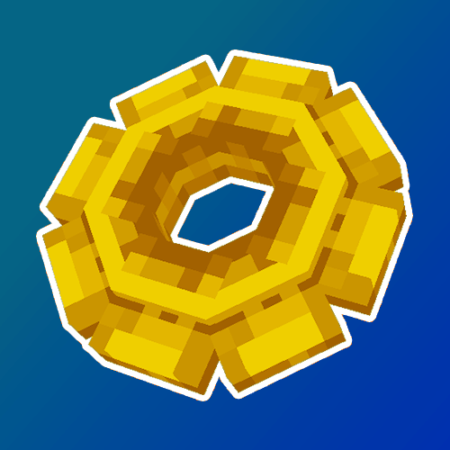
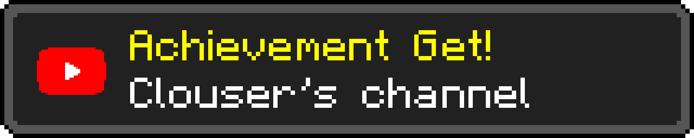

# Clouser's utils mod

This mod adds multiple utils commands and gamerules for Clouser's maps.

    
    
    

# Features

## Commands

### /velocity
The velocity command allows to modify entities velocities. Inputed velocities are in blocks per ticks.
#### Syntax:
- `/velocity <velocity>`
Sets the velocity of the player to the inputed x, y and z velocity. The velocity can be relative
- `/velocity <entity> <velocity>`
Sets the velocity of the targeted entities to the inputed x, y and z velocity. The velocity can be relative.
#### Examples:
| Command                        | Description                                                    |
|--------------------------------|----------------------------------------------------------------|
| `/velocity ~ 1 ~`              | Throws the player in the air at one block per tick             |
| `/velocity @e[type=Pig] 0 0 0` | Stops the movement of all the pigs                             |
| `/velocity @p ~8.4 0 0`        | Increases the nearest player X velocity by 8.4 blocks per tick |

### /clearchat
The clearchat command allows to clear the chat of targeted players.
#### Syntax:
- `/clearchat`
Clears the player chat.
- `/clearchat <player>`
Clears the chat of the specified players.
#### Examples:
| Command         | Description                    |
|-----------------|--------------------------------|
| `/clearchat`    | Clears the player chat         |
| `/clearchat @a` | Clears the chat of all players |

### /perspective
The perspective command allows to modify players perspectives.
#### Syntax:
- `/perspective (firstPerson|thirdPersonBack|thirdPersonFront)`
Sets the player's perspective to the specified one.
- `/perspective <player> (firstPerson|thirdPersonBack|thirdPersonFront)`
Sets the targeted players' perspectives to the specified one.
#### Examples:
| Command                        | Description                                    |
|--------------------------------|------------------------------------------------|
| `/perspective thirdPersonBack` | Sets the player's perspective to third person  |
| `/perspective @a firstPerson`  | Sets all players' perspectives to first person |

### /inventory
The inventory command forces targeted players to open or close their inventory.
#### Syntax:
- `/inventory (open|close)`
  Opens or close the player's inventory.
- `/inventory <player> (open|close)`
  Forces the targeted players' to open or close their inventory.
#### Examples:
| Command               | Description                                 |
|-----------------------|---------------------------------------------|
| `/inventory open`     | Opens the player's inventory                |
| `/inventory @a close` | Forces all players to close their inventory |

### /shakeCamera
The shakeCamera command makes targeted players' cameras shake.
#### Syntax:
- `/shakeCamera [strength] [duration]`
  Shakes the player's camera with the specified strength (default: 1.0, min: 0.0, max: 10.0) for the specified duration in ticks (default: 20, min: 0).
- `/shakeCamera clear`
  Stops the player's camera shake.
- `/shakeCamera <player> [strength] [duration]`
  Shakes the targeted players' camera with the specified strength (default: 1.0, min: 0.0, max: 10.0) for the specified duration in ticks (default: 20, min: 0).
- `/shakeCamera <player> clear`
  Stops the players' camera shake.
#### Examples:
| Command                  | Description                                         |
|--------------------------|-----------------------------------------------------|
| `/shakeCamera 0.5`       | Shakes the player's camera with a strenght of 0.5   |
| `/shakeCamera @a clear`  | Stops the camera shaking of all players             |
| `/shake C1OUS3R 1 40`    | Shakes C1OUS3R's camera during 40 ticks (2 seconds) |

### /fov
The fov command allows to modify targeted players' FOV settings.
#### Syntax:
- `/fov (set|add|remove|multiply|divide) <value>`
  Sets the player's FOV according to the chosen operation with the chosen value. The minimal final value is 5 and the maximal final value is 180.
- `/fov (set|add|remove|multiply|divide) <value> <player>`
  Sets the targeted players' FOV according to the chosen operation with the chosen value. The minimal final value is 5 and the maximal final value is 180.
#### Examples:
| Command                             | Description                              |
|-------------------------------------|------------------------------------------|
| `/fov set 90`                       | Sets the player's FOV to 90              |
| `/fov add 38 @a`                    | Adds 38 to every player's FOV            |
| `/fov divide 2 C1OUS3R`             | Divides C1OUS3R's FOV by 2               |
| `/fov multiply 1.5 Mortimer_Kerman` | Multiplies Mortimer\_Kerman's FOV by 1.5 |

## Gamerules

| Rule name               | Description                                                                  | Default value | Type   |
|-------------------------|------------------------------------------------------------------------------|---------------|--------|
| `canPlayerMove`         | Whether the players can move                                                 | `true`        | Bool   |
| `axisXenabled`          | Whether the players can move their heads horizontally                        | `true`        | Bool   |
| `axisYenabled`          | Whether the players can move their heads vertically                          | `true`        | Bool   |
| `canPlayerJump`         | Whether the players can jump                                                 | `true`        | Bool   |
| `perspectiveLocked`     | Whether the player's perspective is locked                                   | `false`       | Bool   |
| `playerStepHeight`      | Max player's step height. Default is 0.6 to allow to step on stairs or slabs | `0.6`         | Double |
| `canPlayerFall`         | Whether the player can fall and jump                                         | `true`        | Bool   |
| `cameraClip`            | Whether the camera is clipped through blocks in third person                 | `true`        | Bool   |
| `playerEyeHeightFactor` | Multiplier for player's eye height                                           | `1`           | Double |

# License and credits

This mod is open-source and copyrighted under MIT licence. Full license [here](LICENSE).

